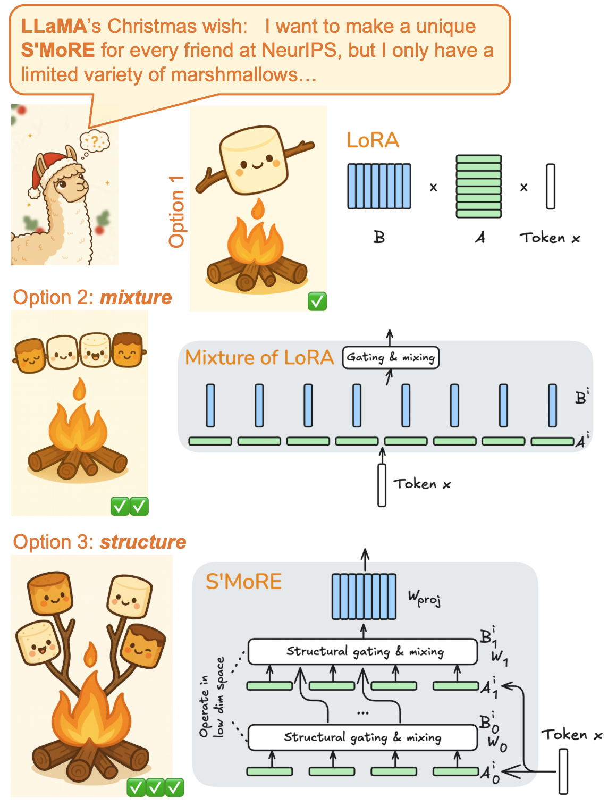
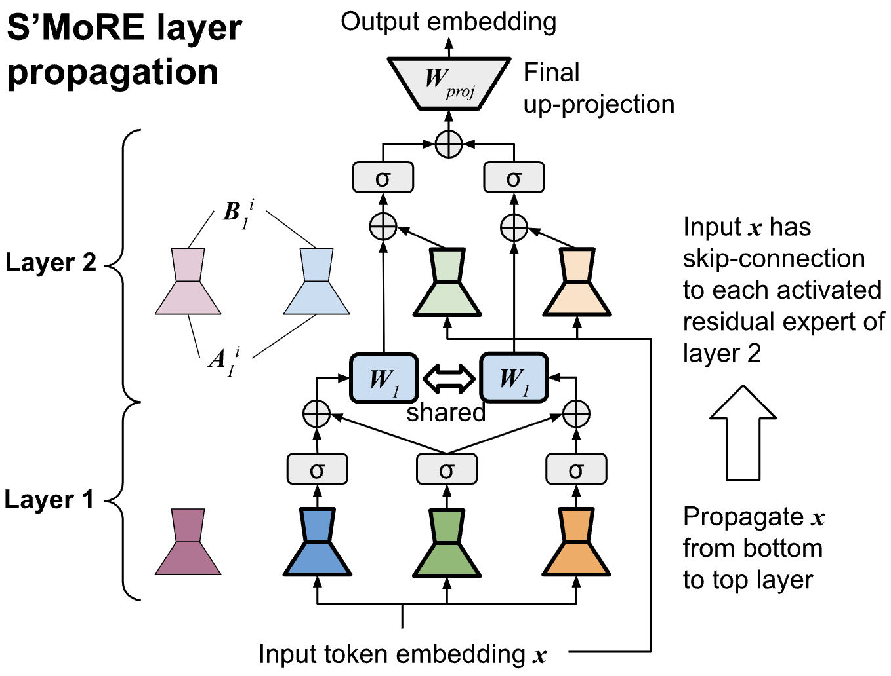
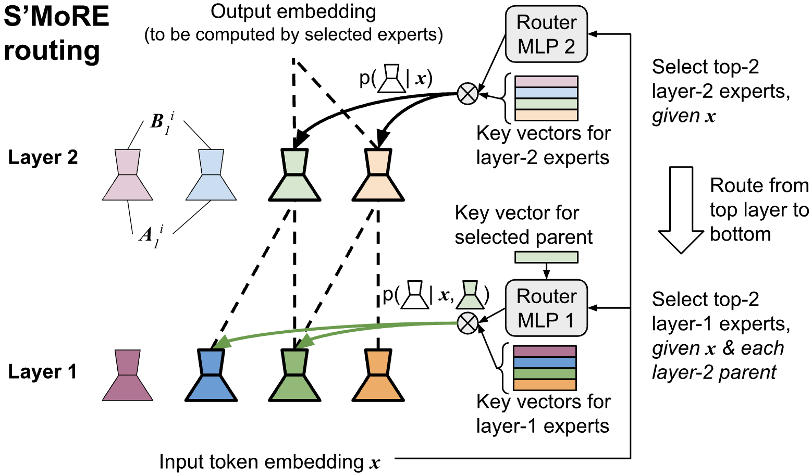

<div align="center">
  
  <h1>S'MoRE: Structural Mixture of Residual Experts for Parameter-Efficient LLM Fine-tuning</h1>
  <p>
    <a href="https://neurips.cc/Conferences/2025">
      
    </a>
  </p>
  <a href="https://arxiv.org/abs/2504.06426">
      
    </a>
  <p>
    Fine-tuning pre-trained large language models (LLMs) presents a dual challenge of balancing parameter efficiency and model capacity. Existing methods like low-rank adaptations (LoRA) are efficient but lack flexibility, while Mixture-of-Experts (MoE) enhance model capacity at the cost of more & under-utilized parameters. To address these limitations, we propose Structural Mixture of Residual Experts (S’MoRE), a novel framework that seamlessly integrates the efficiency of LoRA with the flexibility of MoE. Conceptually, S’MoRE employs hierarchical low-rank decomposition of expert weights, yielding residuals of varying orders interconnected in a multi-layer structure. By routing input tokens through sub-trees of residuals, S’MoRE emulates the capacity of numerous experts by instantiating and assembling just a few low-rank matrices. We craft the inter-layer propagation of S’MoRE’s residuals as a special type of Graph Neural Network (GNN), and prove that under similar parameter budget, S’MoRE improves structural flexibility of traditional MoE (or Mixture-of-LoRA) by exponential order. Comprehensive theoretical analysis and empirical results demonstrate that S’MoRE achieves superior fine-tuning performance, offering a transformative approach for efficient LLM adaptation. 
  </p>
  
<!-- <p>
  <a href="https://github.com/ZimpleX/SMoRE-LLM/graphs/contributors">
    
  </a>
  <a href="">
    
  </a>
</p> -->
   
</div>

Contact: `zhqhku@gmail.com`

## Overview

### How to make the best S'MoRE?



### S'MoRE: layer propagation



### S'MoRE: hierarchical routing




## Setup

We integrate `S'MoRE` as an additional type of adapter in the [peft](https://github.com/huggingface/peft) library, and
extend the [LLaMA-Factory](https://github.com/hiyouga/LLaMA-Factory) codebase to support SFT training of S'MoRE. 
In the `peft/` and `LLaMA-Factory/` folders, we keep only the necessary files for `S'MoRE` training and remove all the other irrelevant files in the original packages. 

To install SFT training environment, run the following:

```
cd scripts/
bash setup_train_env.sh
conda activate smore_train
```

The above setup script will
* `pip install` necessary dependencies such as
  * `deepspeed` and `accelerate` for multi-GPU training
  * `transformers` for model definition
  * `wandb` for logging in the "W\&B" web interface
  * etc.
* Install 3 local packages in editable mode under `peft/`, `LLaMA-Factory/` and `model_moe/`

Other preparations:
* Log in HuggingFace so that it can download base model checkpoints. 
  * Run `huggingface-cli login` from the command line. 
* Log in W\&B to log the training curves to your own account. e.g., you can set `WANDB_API_KEY` to [your own key](https://wandb.ai/authorize). 
* The dataset format follows exactly LLaMA-Factory. You can refer to their [README](https://github.com/hiyouga/LLaMA-Factory?tab=readme-ov-file#data-preparation) to prepare your own data. 


## File structure

`peft/`: customization of the HuggingFace peft library to support S'MoRE adapter
* The base peft version is [0.14.1.dev0](https://github.com/ZimpleX/SMoRE-LLM/blob/main/peft/setup.py#L18). 
* `peft/src/peft/tuners/hier_moe/`: full implementation of S'MoRE adapter. 
  * Check `SMoREFFN` class of [`layer.py`](https://github.com/ZimpleX/SMoRE-LLM/blob/main/peft/src/peft/tuners/hier_moe/layer.py) for model architecture.
  * We have implemented the main version (Eq. 3 in paper) as well as the two variants (`S'MoRE*` and `S'MoRE#`) described in Sec 3.6. 
  * The [`model.py`](https://github.com/ZimpleX/SMoRE-LLM/blob/main/peft/src/peft/tuners/hier_moe/model.py) sets up the S'MoRE adapter with the corresponding base model layer. 

`model_moe/`: Two functionalities: 1. gating implementation 2. customization of the transformer layer of the base model (LLaMA 3 & Gemma 2). The main change is to let the model `forward()` support the auxiliary loss returned by the MoE adapter. 
* [`moe_gates.py`](https://github.com/ZimpleX/SMoRE-LLM/blob/main/model_moe/src/model_moe/moe/moe_gates.py): 2 sparse gates and 1 dense gate as tested in Table 2. The sparse gates also returns an auxiliary loss for experts' load-balancing. 
* [`modeling_llama_moe.py`](https://github.com/ZimpleX/SMoRE-LLM/blob/main/model_moe/src/model_moe/modeling_llama_moe.py): mostly a copy of the `modeling_llama.py` file in HuggingFace's `transformers` library. We mainly changed it to be compatible with the MoE component (e.g., extend the function signature to include the auxiliary loss)
* [`modeling_gemma2_moe.py`](`https://github.com/ZimpleX/SMoRE-LLM/blob/main/model_moe/src/model_moe/modeling_gemma2_moe.py`): similar as above. This extends the gemma model file in `transformers` library for MoE compatibility. 
* [`stats.py`](https://github.com/ZimpleX/SMoRE-LLM/blob/main/model_moe/src/model_moe/model_utils/stats.py): it counts the basic stats of the model such as trainable parameters, etc. 
* [`sft_constants.py`](https://github.com/ZimpleX/SMoRE-LLM/blob/main/model_moe/src/model_moe/sft_constants.py): defines the file path for model checkpoints. Only the adapter weights are stored in the checkpoint (base model weights are frozen). 


`LLaMA-Factory/`: a minimum version of the [`LLaMA-Factory`](https://github.com/hiyouga/LLaMA-Factory) repo. We have only kept the pipeline related to SFT. 
* Our changes are based on version [0.9.2.dev0](https://github.com/ZimpleX/SMoRE-LLM/blob/main/LLaMA-Factory/src/llamafactory/extras/env.py#L29)
* `examples/`: the yaml config to specify the SFT hyperparameters (see section below for detailed description).
* The training entry point is `run_sft()` in [`workflow.py`](https://github.com/ZimpleX/SMoRE-LLM/blob/main/LLaMA-Factory/src/llamafactory/train/sft/workflow.py#L103). 
  * Currently the W\&B project name is hard-coded [here](https://github.com/ZimpleX/SMoRE-LLM/blob/main/LLaMA-Factory/src/llamafactory/train/sft/workflow.py#L116). 
* [`WandbCallback`](https://github.com/ZimpleX/SMoRE-LLM/blob/main/LLaMA-Factory/src/llamafactory/train/sft/workflow.py#L116) customizes what to log into W\&B


## Launch training

We put two example training config files under `LLaMA-Factory/examples` (one for LLaMA 3 and the other for Gemma 2). 

Example training run:

```
cd LLaMA-Factory/
llamafactory-cli train examples/llama3_8b_smore_sft_peft.yaml
```

The yaml file defines the base model, peft adapter type (i.e., `smore`), dataset, and all relevant hyperparameters for the adapter architecture and training algorithm. Specifically:

| Param name | Symbol in paper | Meaning |
| --- | --- | --- |
| `model_zoo_name` |  | must match the dict keys specified in [`sft_constants.py`](https://github.com/ZimpleX/SMoRE-LLM/blob/main/model_moe/src/model_moe/sft_constants.py#L46) |
| `data_template`| | `gemma` for Gemma 2 9B base model and `llama3` for LLaMA 3 8B and LLaMA 3.2 1B
| `moe_num_experts`| $s_\ell$ | list of int. e.g., `[4, 4]` means two S'MoRE layers, each with 4 experts (where the router will pick top-K from the 4 experts) |
| `moe_num_active` | $f_\ell$ | list of int. e.g., `[2, 2]` means the router will activate 2 experts for each token in layer 2, and for each selected layer-2 parent expert, the router will further pick 2 children experts in layer 1 |
| `moe_expert_dims` | $r_\ell$ | list of int. e.g., `[8, 16]` means each layer-1 expert has rank 8 and each layer-2 expert has rank 16 |
| `moe_gate_dims` | | list of int where each value specifies the hidden dimension of the router MLP in each layer (if the length of the list is 1, then we set the hidden dimension to be the same for all layers) |
| `moe_dim_downproj_x` |  $d_\text{down}$ | down-projection of token embedding before processed by router |
| `moe_expert_act_fn` | $\sigma(\cdot)$ | activation function between S'MoRE layers |
| `moe_gate_act_fn` | | activation function for router MLP |
| `moe_init_method` | | initialization of S'MoRE weights. LoRA init $B$ to 0 and $A$ as random (so that on init, the adapter outputs 0 for any token). Similarly for S'MoRE, we init $W_\text{proj}$ to 0. For the other params, we have implemented two options: 1. `w_final_zero`: $B_\ell^i$ and $W_\ell$ are random-init with Kaiming; 2. `eq_1_layer`: set $B_\ell^i$ and $W_\ell$ according to proof of Proposition 3.2 (Appendix C.2.1), so that the multi-layer S'MoRE is identical to 1-layer MoE at init. |
| `moe_activation_position` |  | specifies where to perform activation function in a S'MoRE layer. See the "S'MoRE*" variant in Section 3.6 |
| `moe_is_shared_expert_pool` | | whether the different S'MoRE layers should share the same set of experts. See the "S'MoRE#" variant in Section 3.6 |


You can customize your own adapter or perform hyperparameter sweep by updating the yaml configs accordingly. 
You can adjust other parameters (e.g., batch size, gradient accumulation steps, etc) accordingly based on your machine configuration. All experiments in our paper were run on a node with 4 NVIDIA A100 GPUs. 


## Evaluation

After training, we use the [opencompass](https://github.com/open-compass/opencompass) pipeline to perform model evaluation via end-to-end generation. You need to locate the path for the model checkpoint (see [`sft_constants.py`](https://github.com/ZimpleX/SMoRE-LLM/blob/main/model_moe/src/model_moe/sft_constants.py) described above), and pass it to opencompass. 
* For each benchmark, we reuse the prompt template in the official [opencompass](https://github.com/open-compass/opencompass) repo. 
* This evaluation flow using opencompass is similar to other works, such as [HydraLoRA](https://github.com/Clin0212/HydraLoRA?tab=readme-ov-file#3-evaluate). 


## BibTex

```
@inproceedings{
smore,
title={S'Mo{RE}: Structural Mixture of Residual Experts for Parameter-Efficient {LLM} Fine-tuning},
author={Hanqing Zeng and Yinglong Xia and Zhuokai Zhao and Chuan Jiang and Qiang Zhang and Jiayi Liu and Qunshu Zhang and Lizhu Zhang and Xiangjun Fan and Benyu Zhang},
booktitle={The Thirty-ninth Annual Conference on Neural Information Processing Systems},
year={2025},
url={https://openreview.net/forum?id=LbNL8xGai2}
}
```
